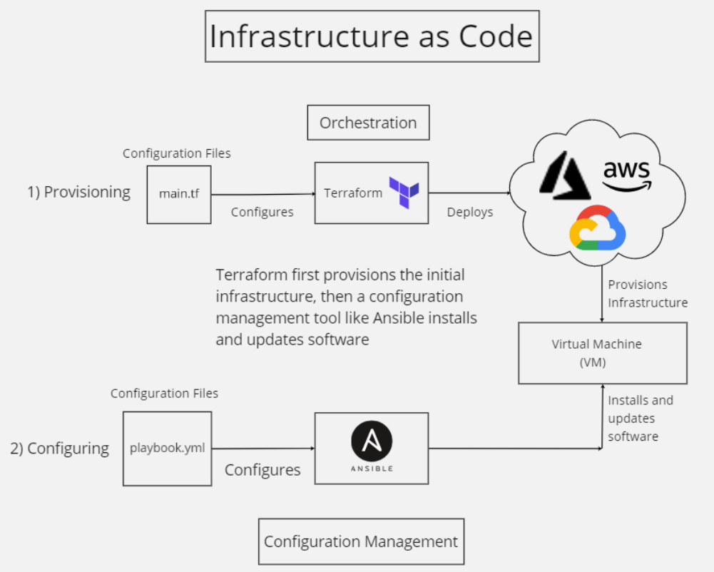

# Terraform



## What is Terraform
- Terraform is an open-source infrastructure as code software tool.

- It is a tool for building, changing and versioning infrastructure safely and efficiently.

- Terraform enables developers to use a high-level configuration language called HCL (HashiCorp Configuration Language) to describe the desired “end-state”

- Terraform files are created with a .tf extention

- Terraform allows to build instances from existing AMIs

## Why Terraform

- Open source, as it is freely available ans is backed by large communities of contributors who build plugins to the platform.

- Platform agnostic: Meaning you can use it with any cloud services provider. Most other IaC tools are designed to work with single cloud provider.

- Immutable infrastructure: Terraform provisions immutable infrastructure, which means that with each change to the environment, the current configuration is replaced with a new one that accounts for the change, and the infrastructure is reprovisioned. Even better, previous configurations can be retained as versions to enable rollbacks if necessary or desired.

## Terraform commands
- `terraform init`: Prepare your working directory for other commands
- `terraform validate`: Check whether the configuration is valid
- `terraform plan`: Show changes required by the current configuration
- `terraform apply`: Create or update infrastructure
- `terraform destroy`: Destroy previously-created infrastructure

## Secure
To keep it secure we use access key and secret key and we store them as variables.

### variable setup - mac
```bash
 sudo echo "export AWS_ACCESS_KEY_ID=<Your access key>" >> ~/.bashrc
  sudo echo "export AWS_SECRET_ACCESS_KEY=<Your secret key>" >> ~/.bashrc
 source ~/.bashrc
 ```

### variable setup - windows
- on search bar look for `edit the system environmemt variable`
- on tag `advance` at the bottom click on `Environment Variables`
- On the new window, under `user variable for shuvo` click on `new`
- Add your access and secret keys

## Set provider
The set provider is used to create your script

```bash
#Specify a cloud provider and region
# define the region to launch the ec2 instance in Ireland
provider "aws" {
	region = "eu-west-1" #or "${var.region}"
}
```
## Launch EC2 instance with Resources

- Initialize terraform: `terraform init`

- A resource block declares a resource of a given type, and a given local name which can be used to refer to the resource from elsewhere in the same Terraform module

- The resource type and name together serve as an identifier for a given resource and so must be unique within a module

```bash

resource "aws_instance" "Shuvo_app" {

     ami = "ami-0943382e114f188e8"
 
     instance_type = "t2.micro" #or "${var.instance_type}"

  subnet_id = aws_subnet.shuvo_sn_app_pub.id
  
  vpc_security_group_ids = [aws_security_group.shuvo_app_sg.id]  # we put this in [] because it rapresents a list

  key_name = var.key_name     # reference to the public key on aws 

  associate_public_ip_address = true
  connection {                           # this is used so we can ssh into the instance 
      type        = "ssh"
      host        = self.public_ip
      user        = "ubuntu"
      private_key = file("~/.ssh/eng119.pem") #or file("${var.aws_key_path}")
  }

  tags = {
       Name = "eng110_shuvo_app_tf"
  }

}

# the below line can also be used if in case we did not have already a public key in the cloud 

#resource "aws_key_pair" "ssh" {
#  key_name   = var.key_name
#  public_key = "${var.ssh_key}"
#}
# you can create a new name for the existing public key like above or you can reference the already existing public with name eng119 
```
## Variables
- Here we will be setting all the variables needed to create the VPC. It is good practice as it uses DRY (Don't Repeat Yourself).

- Variables can be defined in a separate file variables.tf and then referenced in the main.tf files using var.resource_name.

```bash
variable "aws_key_name" {
    default = "eng119"
}

variable "aws_key_path" {
    default = "~/.ssh/eng119.pem"
}

variable "region" {
    default = "eu-west -1"
}

variable "instance_type"{
    default = "t2.micro"
}
```
## VPC
```bash
resource "aws_vpc" "shuvo_vpc" {
  cidr_block = "${var.vpc-cidr}"
  instance_tenancy = "default"
  enable_dns_support = true   #this gives the dns address 
  enable_dns_hostnames = true #this gives the dns address 
  tags = {
     Name = "shuvo_vpc"
  }
}
```

## Internet Gateway
```bash
resource "aws_internet_gateway" "shuvo_app_ig" {
  vpc_id = aws_vpc.shuvo_vpc.id

  tags = {
    Name = "shuvo_app_ig"
  }
}
```

## Public subnet
```bash
resource "aws_subnet" "shuvo_sn_app_pub" {
  vpc_id     = aws_vpc.shuvo_vpc.id
  cidr_block = "${var.pub_sn_cidr}"
  availability_zone = "eu-west-1a"
  map_public_ip_on_launch = true
  tags = {
    Name = "shuvo_sn_app_pub"
  }
} 
```
## Private subnet
```bash
resource "aws_subnet" "shuvo_sn_db_pri" {
  vpc_id     = aws_vpc.shuvo_vpc.id
  cidr_block = "${var.pri_sn_cidr}"
  availability_zone = "eu-west-1a"
  map_public_ip_on_launch = false
  tags = {
    Name = "shuvo_sn_db_pri"
  }
}
```

## Route Table
```bash
resource "aws_route_table" "shuvo_rt" {
  vpc_id = aws_vpc.shuvo_vpc.id

  route {
    cidr_block = "0.0.0.0/0"
    gateway_id = aws_internet_gateway.shuvo_app_ig.id
  }

  tags = {
    Name = "shuvo_rt"
  }
}
```

### connecting route table to subnet
```bash
resource "aws_route_table_association" "shuvo_rt_sn_pub" {
  subnet_id      = aws_subnet.shuvo_sn_app_pub.id
  route_table_id = aws_route_table.shuvo_rt.id
}
```
## Security group
```bash 
resource "aws_subnet" "shuvo_sn_app_pub" {
  vpc_id     = aws_vpc.shuvo_vpc.id
  cidr_block = "${var.pub_sn_cidr}"
  availability_zone = "eu-west-1a"
  map_public_ip_on_launch = true
  tags = {
    Name = "shuvo_sn_app_pub"
  }
}     

resource "aws_subnet" "shuvo_sn_db_pri" {
  vpc_id     = aws_vpc.shuvo_vpc.id
  cidr_block = "${var.pri_sn_cidr}"
  availability_zone = "eu-west-1a"
  map_public_ip_on_launch = false
  tags = {
    Name = "shuvo_sn_db_pri"
  }
}

resource "aws_route_table" "shuvo_rt" {
  vpc_id = aws_vpc.shuvo_vpc.id

  route {
    cidr_block = "0.0.0.0/0"
    gateway_id = aws_internet_gateway.shuvo_app_ig.id
  }

  tags = {
    Name = "shuvo_rt"
  }
}

resource "aws_route_table_association" "shuvo_rt_sn_pub" {
  subnet_id      = aws_subnet.shuvo_sn_app_pub.id
  route_table_id = aws_route_table.shuvo_rt.id
}

#resource "aws_route_table_association" "shuvo_ig_rt" {
#  gateway_id     = aws_internet_gateway.shuvo_app_ig.id
#  route_table_id = aws_route_table.shuvo_rt.id
#}

resource "aws_security_group" "shuvo_app_sg" {
  name        = "shuvo_app_sg"
  description = "inboud rules"
  vpc_id      = aws_vpc.shuvo_vpc.id

  ingress {
    description      = "ssh"
    from_port        = 22
    to_port          = 22
    protocol         = "tcp"
    cidr_blocks      = ["62.60.120.134/32"]
  }

  ingress {
    description      = "Nginx"
    from_port        = 80
    to_port          = 80
    protocol         = "tcp"
    cidr_blocks      = ["0.0.0.0/0"]
  }

    ingress {
    description      = "app"
    from_port        = 3000
    to_port          = 3000
    protocol         = "tcp"
    cidr_blocks      = ["0.0.0.0/0"]
  }

  egress {
    from_port        = 0
    to_port          = 0
    protocol         = "-1"
    cidr_blocks      = ["0.0.0.0/0"]
  }

  tags = {
    Name = "shuvo_app_sg"
  }
}
```